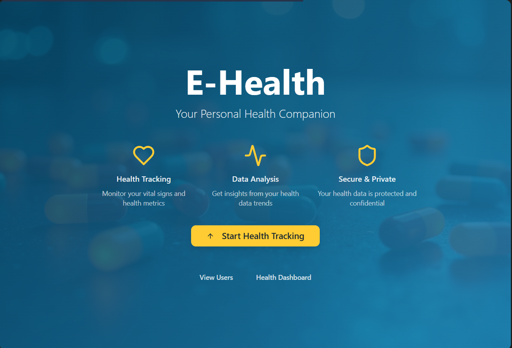
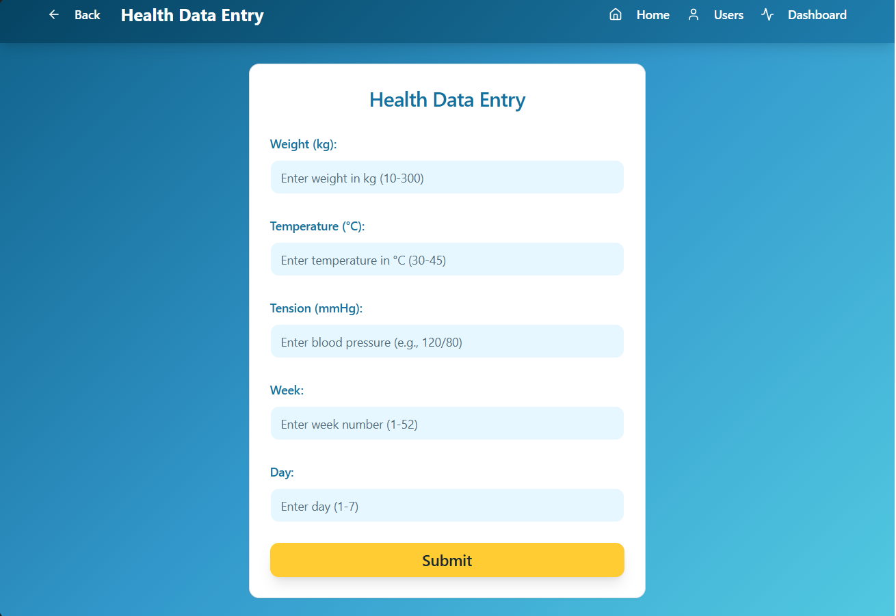
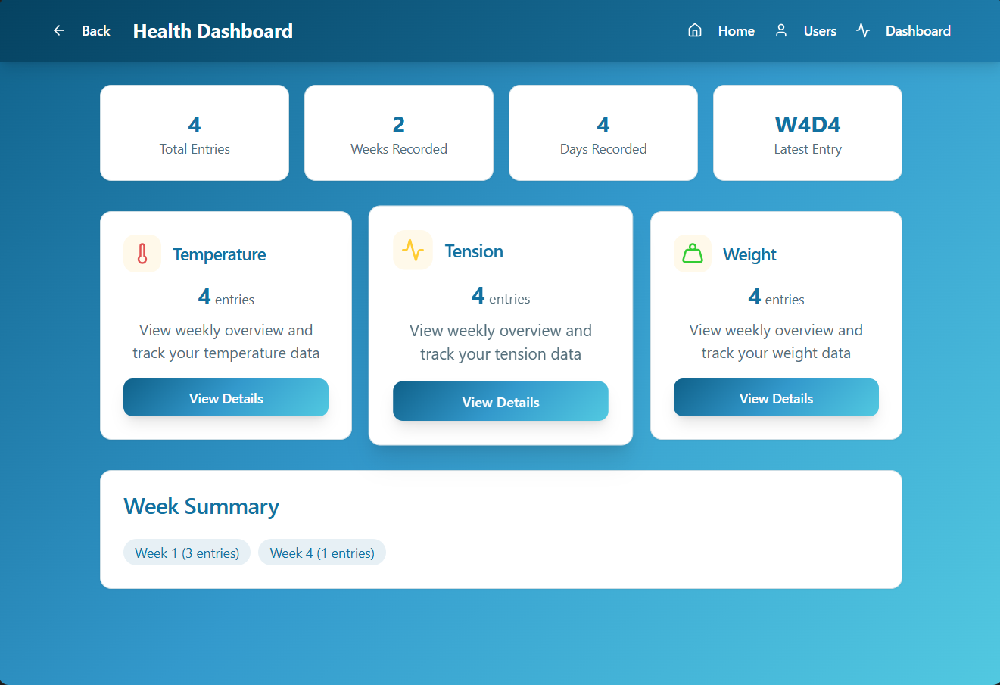
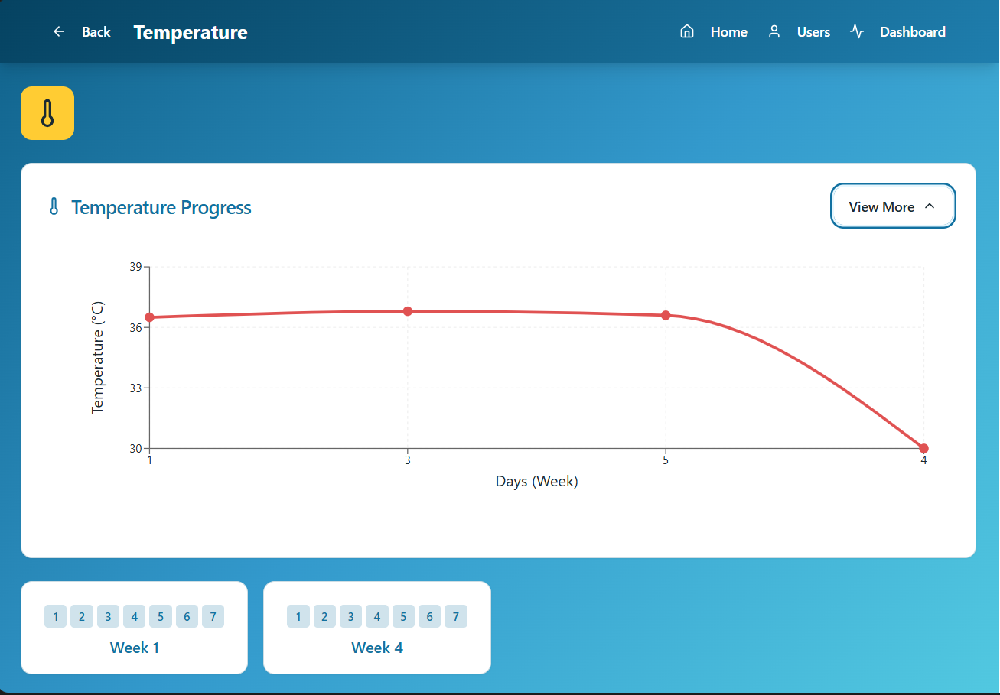
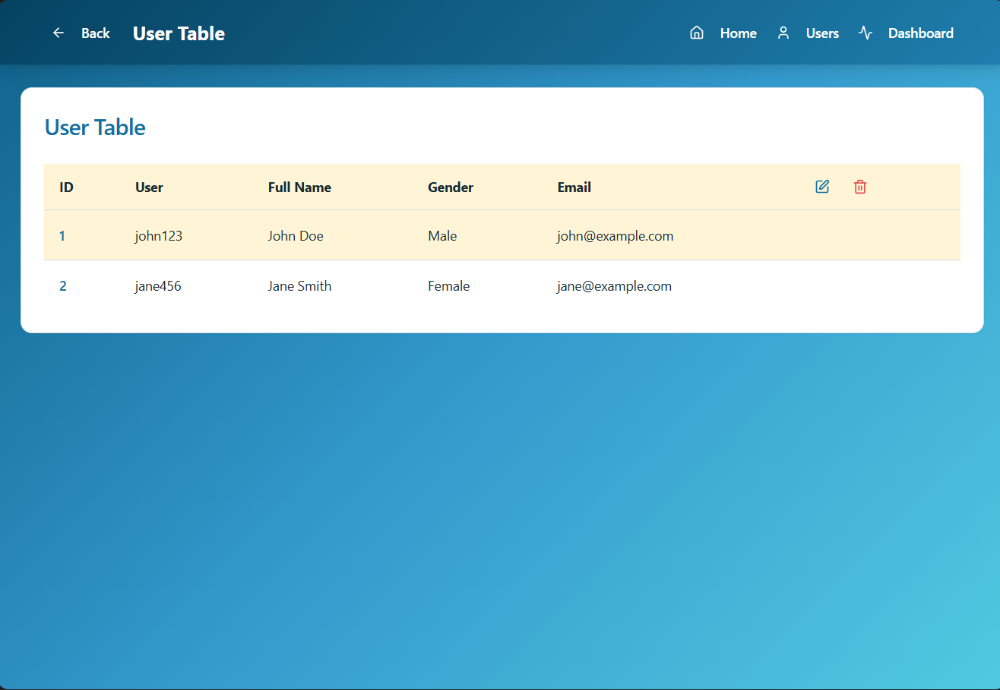

# E-Health - Personal Health Companion

A modern health tracking web application built with React, TypeScript, and Supabase that allows users to monitor and track their vital health metrics including weight, temperature, and blood pressure.

## 🚀 Features

- **Health Data Entry**: Record daily health metrics with validation
- **Interactive Dashboard**: View comprehensive health statistics and trends
- **Secure Data Storage**: Health data persisted in Supabase database
- **Responsive Design**: Optimized for desktop and mobile devices
- **Real-time Updates**: Instant data synchronization across sessions
- **Data Visualization**: Charts and graphs for health trend analysis

## 📊 Health Metrics Tracked

- **Weight**: Track weight changes over time (10-300kg range)
- **Temperature**: Monitor body temperature (30-45°C range)
- **Blood Pressure**: Record tension readings (format: 120/80)
- **Weekly/Daily Tracking**: Organize data by weeks (1-52) and days (1-7)

## 🛠️ Tech Stack

- **Frontend**: React 18, TypeScript, Vite
- **UI Framework**: Tailwind CSS, shadcn/ui components
- **Backend**: Supabase (Database, Authentication ready)
- **Routing**: React Router DOM
- **Charts**: Recharts for data visualization
- **State Management**: React Context API
- **Form Handling**: React Hook Form with validation

## 📁 Project Structure

```
src/
├── components/
│   ├── ui/                 # Reusable UI components (shadcn/ui)
│   ├── HealthCard.tsx      # Health metric display card
│   └── HealthNavigation.tsx # Navigation component
├── contexts/
│   ├── HealthDataContext.tsx # Health data state management
│   └── UserContext.tsx       # User context (future auth)
├── pages/
│   ├── Index.tsx            # Landing page
│   ├── DataEntry.tsx        # Health data input form
│   ├── Dashboard.tsx        # Health metrics dashboard
│   ├── Temperature.tsx      # Temperature tracking page
│   ├── Tension.tsx          # Blood pressure tracking page
│   └── Weight.tsx           # Weight tracking page
├── hooks/
│   └── use-toast.ts         # Toast notification hook
├── integrations/
│   └── supabase/            # Supabase client and types
└── lib/
    └── utils.ts             # Utility functions
```
## 📸 Screenshots

   
   
   
   
   

## 🚀 Getting Started

### Prerequisites

- Node.js (version 18 or higher)
- npm, yarn, or bun package manager
- Supabase account (free tier available)

### Installation

1. **Clone the repository**
   ```bash
   git clone <tayebg/health-app>
   cd e-health-app
   ```

2. **Install dependencies**
   ```bash
   npm install
   # or
   yarn install
   # or
   bun install
   ```

3. **Set up Supabase**
   - Create a new project at [supabase.com](https://supabase.com)
   - Copy your project URL and anon key
   - The database schema is automatically configured

4. **Start the development server**
   ```bash
   npm run dev
   # or
   yarn dev
   # or
   bun dev
   ```

5. **Open your browser**
   Navigate to `http://localhost:8080` to view the application

## 🗄️ Database Schema

The application uses a Supabase PostgreSQL database with the following main table:

### `health_data` Table
```sql
- id: UUID (Primary Key)
- weight: NUMERIC(5,2) 
- temperature: NUMERIC(4,2)
- tension: TEXT
- week: INTEGER (1-52)
- day: INTEGER (1-7)  
- date: DATE
- created_at: TIMESTAMP
- updated_at: TIMESTAMP
```

## 🎯 Usage Guide

### Adding Health Data
1. Click "Start Health Tracking" on the homepage
2. Fill in all required fields:
   - Weight (10-300 kg)
   - Temperature (30-45°C)
   - Blood Pressure (format: 120/80)
   - Week number (1-52)
   - Day number (1-7)
3. Click "Submit" to save data

### Viewing Dashboard
1. Navigate to the Dashboard from the homepage
2. View summary statistics:
   - Total entries count
   - Weeks recorded
   - Days recorded
   - Latest entry information
3. Access individual metric pages for detailed views

### Data Validation
- All fields are required for submission
- Numeric ranges are enforced to prevent unrealistic entries
- Blood pressure must follow XXX/XXX format
- Real-time validation feedback provided

## 🔒 Security Features

- Row Level Security (RLS) enabled on all tables
- Input validation on both client and server side
- Prepared statements prevent SQL injection
- HTTPS encryption for all data transmission

## 🎨 Customization

The app uses a design system with semantic tokens defined in:
- `src/index.css` - CSS custom properties and global styles
- `tailwind.config.ts` - Tailwind CSS configuration
- Theme colors follow a medical/health aesthetic

## 📱 Responsive Design

- Mobile-first approach
- Responsive grid layouts
- Touch-friendly interface
- Optimized for screens from 320px to 4K

## 🚀 Deployment

### Quick Deploy
The application can be deployed to any static hosting service:

- **Vercel**: Connect your GitHub repository
- **Netlify**: Drag and drop the `dist` folder
- **GitHub Pages**: Enable in repository settings

### Build for Production
```bash
npm run build
# or
yarn build
# or
bun run build
```

## 🤝 Contributing

1. Fork the repository
2. Create a feature branch (`git checkout -b feature/amazing-feature`)
3. Commit your changes (`git commit -m 'Add amazing feature'`)
4. Push to the branch (`git push origin feature/amazing-feature`)
5. Open a Pull Request

## 📝 License

This project is licensed under the MIT License - see the LICENSE file for details.

## 🆘 Support

For support and questions:
- Check existing issues in the repository
- Create a new issue with detailed description
- Include steps to reproduce any bugs

## 🔮 Future Enhancements

- User authentication and profiles
- Data export functionality
- Medication tracking
- Doctor appointment scheduling
- Health goals and reminders
- Advanced analytics and insights
- Mobile app version
- Integration with wearable devices

---

**Built with ❤️ for better health tracking**
